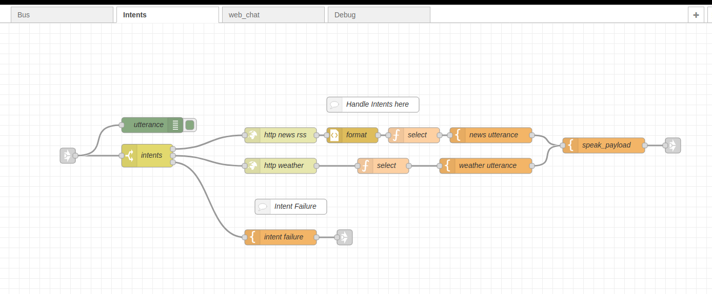

# node red mycroft skill

[Node Red](https://nodered.org/) - Mycroft interface

beginners and non technical users can now leverage visual programming and easily extend mycroft functionality


# Additional Setup

After installing the node red skill you need to deploy some flows in node red

## Messagebus

First deploy [bus flow](sample_flows/bus.txt)

This will open a websocket connection to communicate with mycroft

    ws://username:secret@127.0.0.1:6789

username can be anything, secret is set in web ui of the skill

You need to edit mycroft-in and mycroft-out nodes with the correct secret


## Intents
 
deploy [intents flow](sample_flows/intents.txt), this is where you will add your node red intents



# Installing node red

you might  need to install

    apt-get install libssl-dev libffi-dev
    
read the Node Red [Getting Started Guide](https://nodered.org/docs/getting-started/)

## Firewall

Node red can be running in any machine, does not need to run in same 
place as mycroft, if this is the case open port 6789 in mycroft

```bash
ufw allow 6789
```

Note that it is node red that starts a connection to mycroft, not the other 
way around

## Node red auto start

node red must be running, it can be started with

     node-red-start

or made into a service

    sudo systemctl enable nodered.service
    sudo service nodered start
   
   
check to see if node-red is running at http://127.0.0.1:1880


# Importing flows...


- Copy the JSON text from [some flow.txt](sample_flows/debug.txt)
- Go to http://noderedip:1880
- In the upper righthand corner menu, choose... Import > Clipboard
- This will open the "Import nodes window"
- Paste the contents from the sample_flow.txt
- Click on Import and the flow should appear
- Next click on Deploy
- After you deploy, the websocket nodes should say 'connected' if the skill was installed properly


